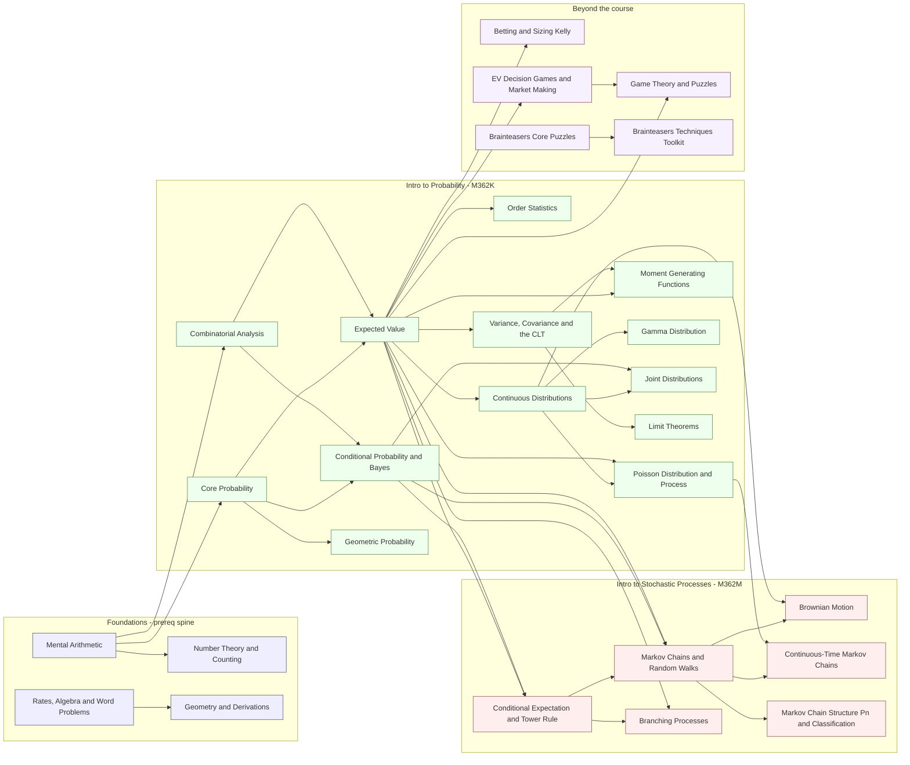

# Case A Knowledge Graph — Course-Mastery Curriculum

**Deliverable type:** analysis + documentation (no app source changed, no commits).
**Question answered:** for the Case A ("course mastery") mode, does the set of
concepts, their prerequisites, and the two-course structure make sense?

**Case A** surfaces two UT courses to the learner as **"Intro to Probability"**
(internally M362K) and **"Intro to Stochastic Processes"** (internally M362M). The
M362K/M362M codes are used here only for grouping/provenance and are **not** shown
in the UI. Per the agreed decisions:

- **Quant-only competitive content is collapsed** into a *"beyond the course"* area:
  Betting/Kelly, Game Theory, EV Decision Games / Market Making, Brainteasers, plus
  the Foundations (mental-math / applied-math) prerequisite spine.
- **The "Extra Relevant Knowledge" topics are integrated** as first-class course
  topics: MGF, Gamma, Joint Distributions, Limit Theorems (→ M362K) and Branching,
  CTMC, Markov structure (→ M362M).

**Sources parsed:** `datasets/CASE_MODE_BUILD_PLAN.md` (§4 course→topic map,
authoritative for grouping) and `datasets/UT_COURSE_GAP_ANALYSIS.md` (syllabus map);
`src/content/index.ts`, `src/content/probability/levels.ts`,
`src/content/probabilityStats/index.ts` + all 26 `src/content/**/levels.ts`;
`src/content/remediation/prereqDAG.ts`; `src/lib/roadmap/skillGraph.ts`;
`src/lib/simulations/catalog.ts` (double-integral sim).

> **Key data fact (updated after the ERK split).** The seven "integrated" topics
> (MGF, Gamma, Joint Distributions, Limit Theorems, Branching, CTMC, Markov Chain
> Structure) are now **first-class**: each carries its **own** `section` and therefore
> its **own** `topicKey`, mastery bucket, skill-graph node, and remediation-DAG node —
> with its **own** prerequisites and its **own** scored `levelRef`. They are no longer
> folded into the single `probability::Extra Relevant Knowledge` bucket (that node has
> been removed). Case A's integration is now a genuine data structure, not a
> display-only re-label. Case B still *displays* these seven under an "Extra Relevant
> Knowledge" category, but that is a projection concern over the same seven topicKeys.

`topicKey` format is `${trackId}::${section ?? "_core"}` (`src/lib/mastery/topicKey.ts`).
"Scored" = a graded `numeric`/`quiz` level; `flashcard` levels are self-assessed and
are **not** scored (and are excluded from the remediation DAG by design).

---

## 1. Case-A concepts, grouped by track

### 1.1 Track — "Intro to Probability" (M362K)

| Concept (section) | topicKey | Scored levels (id · difficulty · mode) | Status |
|---|---|---|---|
| Combinatorial Analysis | `probability::Combinatorial Analysis` | ca-1 easy·num, ca-2 easy·num, ca-3 easy·num, ca-comp easy·num, ca-bino easy·num, ca-symm easy·quiz, ca-4 med·num, ca-5 med·num, ca-6 med·num, ca-7 med·num, ca-tourn med·num, ca-count med·num, ca-8 hard·num · (ca-9 hard·flashcard) | reuse |
| Core Probability | `probability::Core Probability` | pr-1 easy·num, pr-2 med·num, pr-3 med·num, pr-4 hard·num, pr-5 expert·num | reuse |
| Conditional Probability & Bayes | `probability::Conditional Probability` | cp-1 easy·num, cp-2 med·num, cp-3 med·num, cp-4 med·num, cp-5 med·quiz · (cp-6 hard·flashcard) | reuse (shared w/ M362M) |
| Expected Value | `probability::Expected Value` | ev-1 easy·num, ev-2 easy·num, ev-3 med·num, ev-4 med·num, ev-5 med·num, ev-6 hard·num, ev-7 hard·quiz · (ev-8 hard·flashcard) | reuse |
| Poisson Distribution & Process | `probability::Poisson Distribution & Process` | po-1 med·num, po-2 hard·num, po-3 hard·num | reuse (shared w/ M362M) |
| Geometric Probability | `probability::Geometric Probability` | geo-1 easy·num, geo-2 med·num | reuse (M362K ch.5) |
| Order Statistics | `probability::Order Statistics` | os-1 med·num | reuse |
| Continuous Distributions | `probability::Continuous Distributions` | cd-1 med·num, cd-2 med·num, cd-3 hard·num | reuse |
| Variance, Covariance & the CLT | `probability::Variance, Covariance & the CLT` | vc-1 med·num, vc-2 hard·num · (vc-3 hard·flashcard) | reuse |
| **MGF** *(first-class)* | `probability::Moment Generating Functions` | ek-mgf med·quiz | done |
| **Gamma Distribution** *(first-class)* | `probability::Gamma Distribution` | ek-gamma med·num | done |
| **Joint Distributions** *(first-class, expanded)* | `probability::Joint Distributions` | ek-joint hard·num, ek-joint-2 med·num, ek-joint-3 hard·num | done |
| **Limit Theorems (Chebyshev/LLN/CLT)** *(first-class)* | `probability::Limit Theorems` | ek-limit hard·quiz | done |

### 1.2 Track — "Intro to Stochastic Processes" (M362M)

| Concept (section) | topicKey | Scored levels (id · difficulty · mode) | Status |
|---|---|---|---|
| Conditional Expectation & the Tower Rule | `probability::Conditional Expectation` | ce-1 med·num, ce-2 hard·num | **ADD (new)** |
| Markov Chains & Random Walks | `probability::Markov Chains` | mc-1 easy·num, mc-2 easy·num, mc-3 med·num, mc-4 med·num, mc-walk med·num, mc-5 hard·num, mc-stationary hard·num · (mc-6 hard·flashcard) | reuse |
| Brownian Motion | `probability::Brownian Motion` | bm-1 expert·num | reuse |
| **Branching Processes** *(first-class)* | `probability::Branching Processes` | ek-branching hard·num | done |
| **Continuous-Time Markov Chains (+ queues)** *(first-class)* | `probability::Continuous-Time Markov Chains` | ek-ctmc hard·num | done |
| **Markov Chain Structure (Pⁿ / Chapman–Kolmogorov, state classification)** *(first-class)* | `probability::Markov Chain Structure` | ek-markov-pn hard·num, ek-markov-class hard·quiz | done |
| *(shared)* Conditional Probability & Bayes | `probability::Conditional Probability` | see M362K | reuse (M1 review) |
| *(shared)* Poisson Distribution & Process | `probability::Poisson Distribution & Process` | see M362K | reuse (M5) |

> ✅ The 10 scored levels marked *(first-class)* above now live in **seven separate
> buckets** — one topicKey each — ordered in content as MGF → Gamma → Joint →
> Branching → CTMC → Limit Theorems → Markov Chain Structure. Each can be mastered,
> prereq'd, and placed in a track independently. See §4/§5.
>
> **Simulation.** The double-integral topic is live: `src/lib/simulations/catalog.ts`
> group `joint-distributions`, sim `joint-density-integral` ("Double Integral of a
> Joint Density", `topics: ["Joint Distributions"]`) — a bivariate-normal heatmap with
> a live ∫∫ over a draggable region and a Monte-Carlo overlay. It is tied to the
> first-class Joint Distributions topic above (`probability::Joint Distributions`).

### 1.3 Beyond the course (collapsed quant-only + foundations)

| Concept (section) | topicKey | Scored levels | Role |
|---|---|---|---|
| Betting & Sizing (Kelly) | `probability::Betting & Sizing` | bs-1 easy·num, bs-2 med·num, bs-3 hard·num, bs-4 expert·num | quant-only |
| Game Theory & Puzzles | `probability::Game Theory & Puzzles` | gt-1 easy·quiz, gp-1 easy·num, gt-2 med·quiz, gt-3 med·quiz, gt-4 hard·num, gt-5 hard·num, gp-2 hard·num, gt-spread hard·num, gt-agents hard·num · (gt-6, gp-3 hard·flashcard) | quant-only |
| EV Decision Games & Market Making | `interview-games::_core` | ~16 levels (ig-*, EV / optimal stopping / market-making; incl. Fermi flashcard) | quant-only |
| Brainteasers · Core Puzzles | `brainteasers::Core Puzzles` | none (bt-1,2,3 flashcard) | synthesis (unscored) |
| Brainteasers · Techniques Toolkit | `brainteasers::Techniques Toolkit` | none (bt-4,5,6 flashcard) | synthesis (unscored) |
| **Foundations** — Mental Arithmetic | `mental-math::_core` | mm-1 easy·num, mm-2 med·num, mm-3 hard·num, mm-4 hard·num | prereq floor |
| **Foundations** — Rates, Algebra & Word Problems | `math-questions::Rates, Algebra & Word Problems` | mq-1 easy·num, mq-3 med·num | prereq floor |
| **Foundations** — Number Theory & Counting | `math-questions::Number Theory & Counting` | mq-4 med·num, mq-2 med·num | prereq |
| **Foundations** — Geometry & Derivations | `math-questions::Geometry & Derivations` | mq-5 hard·num · (mq-6 hard·flashcard) | applied-math |

---

## 2. Prerequisite graph (Mermaid)

Solid arrows = prerequisite edges (`skillGraph.ts` / `prereqDAG.ts`); `A --> B` means
"A is a prerequisite of B". The seven former-ERK topics now carry their **own** real
prereq edges (no dashed bucket-membership edges anymore). Node labels are
ASCII-sanitized for clean rendering.

---

## 3. Prerequisite table (concept → direct prereqs)

| Concept | Direct prerequisites | Source |
|---|---|---|
| Mental Arithmetic | — (floor) | DAG + skillGraph |
| Rates, Algebra & Word Problems | — (floor) | DAG + skillGraph |
| Number Theory & Counting | Mental Arithmetic | DAG + skillGraph |
| Geometry & Derivations | Rates, Algebra | DAG + skillGraph |
| Combinatorial Analysis | Mental Arithmetic | DAG + skillGraph |
| Core Probability | Mental Arithmetic (floor) | DAG + skillGraph |
| Conditional Probability & Bayes | Core Probability, Combinatorial Analysis | DAG + skillGraph |
| Expected Value | Core Probability, Combinatorial Analysis | DAG + skillGraph |
| Poisson Distribution & Process | Expected Value, **Continuous Distributions** | DAG + skillGraph |
| Geometric Probability | Core Probability | DAG + skillGraph |
| Order Statistics | Expected Value | DAG + skillGraph |
| Continuous Distributions | Expected Value | DAG + skillGraph |
| Variance, Covariance & the CLT | Expected Value | DAG + skillGraph |
| Conditional Expectation | Expected Value, Conditional Probability | DAG + skillGraph |
| Markov Chains & Random Walks | Conditional Probability, Expected Value, **Conditional Expectation** | DAG + skillGraph |
| Brownian Motion | Markov Chains, Continuous Distributions | DAG + skillGraph |
| **Moment Generating Functions** | Expected Value, Variance/Covariance & the CLT | DAG + skillGraph |
| **Gamma Distribution** | Continuous Distributions | DAG + skillGraph |
| **Joint Distributions** | Continuous Distributions, Conditional Probability | DAG + skillGraph |
| **Limit Theorems** | Variance/Covariance & the CLT | DAG + skillGraph |
| **Branching Processes** | Expected Value, Conditional Expectation | DAG + skillGraph |
| **Continuous-Time Markov Chains** | Markov Chains, Poisson Distribution & Process | DAG + skillGraph |
| **Markov Chain Structure** | Markov Chains | DAG + skillGraph |
| Betting & Sizing (Kelly) | Expected Value | DAG + skillGraph |
| EV Decision Games & Market Making | Expected Value | DAG + skillGraph |
| Game Theory & Puzzles | EV Decision Games & Market Making, **Expected Value** | DAG + skillGraph |
| Brainteasers · Core Puzzles | — | skillGraph (flashcard; out of DAG) |
| Brainteasers · Techniques Toolkit | Brainteasers · Core Puzzles | skillGraph (flashcard; out of DAG) |

---

## 4. Structure analysis

### 4.1 Cycles
**None.** Both the skill graph and the prereq DAG are acyclic; every edge points from
an earlier tier to a later one (foundations → probability → expectation/distributions
→ processes → synthesis). Verified by inspection of all edges in §3 — no node is
reachable from its own descendants.

### 4.2 Orphans (no prereqs and not a foundation)
- **Mental Arithmetic** and **Rates, Algebra** — no prereqs, but they are explicit
  FLOORs. ✅ expected.
- **Brainteasers · Core Puzzles** — no prereqs and *not* a declared foundation. It is a
  flashcard-only synthesis track (unscored, out of the DAG). Acceptable, but it is a
  genuine orphan; in Case A it is "beyond the course" and can simply be hidden.
- No other orphans. Every M362K/M362M concept has at least one prerequisite.

### 4.3 Scored but missing from the DAG / skill graph — RESOLVED
1. **Conditional Expectation** (`probability::Conditional Expectation`, ce-1/ce-2) is now
   a first-class node in **both** `skillGraph.ts` and `prereqDAG.ts` with prereqs
   **[Conditional Probability & Bayes, Expected Value]** and `levelRef` ce-1. ✅ The
   remediation gap is closed. *(Historical: it was once skill-graph-only.)*
2. **The seven former-ERK topics** (MGF, Gamma, Joint Distributions, Limit Theorems,
   Branching, CTMC, Markov Chain Structure — 10 scored levels) now each have their **own**
   node in both graphs, with their own prereqs and their own scored `levelRef` (§3). ✅
   They can be mastered, ordered, and prereq'd separately — the Case A requirement is met.
   The DAG now covers **26** scored topics (was 20, − 1 ERK + 7).

### 4.4 Edges — status after the split + corrections
- **Markov chains require Conditional Probability + Expected Value + Conditional
  Expectation.** ✅ The CE edge was ADDED (first-step analysis / hitting times are
  tower-rule arguments) — the right footing for random walks / gambler's ruin.
- **Stochastic-processes content sits atop the probability track.** ✅ Markov Chains →
  {Conditional, EV, Conditional Expectation}; Brownian Motion → {Markov, Continuous}.
- **Conditional Expectation now functions as a bridge.** ✅ **Branching Processes** lists
  it as a prerequisite (extinction via PGF/first-step conditioning), and Markov Chains
  now requires it too. It is no longer a dead-end leaf.
- **The M362K↔M362M ordering inversion is gone.** ✅ MGF/Gamma/Joint/Limit now carry their
  own M362K prereqs (Expected Value / Continuous / Variance-CLT / Conditional) instead of
  the old blanket **[Variance/CLT, Markov Chains]**, so no M362K topic sits behind M362M
  Markov Chains anymore. (CTMC and Markov Chain Structure correctly *do* require Markov.)
- **Poisson depth → Continuous Distributions.** ✅ Edge ADDED — the Poisson-*process*
  levels (po-2/po-3: exponential interarrivals) now correctly depend on the exponential
  density taught in Continuous Distributions.
- **Brownian Motion ↛ Variance/CLT.** Still only {Markov, Continuous}. A Variance/CLT
  edge would be more faithful (Gaussian increments) but is out of scope here. Minor.

### 4.5 Track placement vs. a real M362K/M362M syllabus
Cross-checked against `UT_COURSE_GAP_ANALYSIS.md` §1 (Ross chs. 1–8 for M362K; Markov/
Poisson/branching/CTMC/Brownian for M362M):
- **Geometric Probability → M362K** (ch. 5 continuous/uniform, applied). ✅
- **Order Statistics → M362K** (chs. 6–7). ✅
- **Joint Distributions, MGF, Gamma, Limit Theorems → M362K.** ✅ correct (chs. 5–8);
  now first-class with their own M362K prereqs, so the former mis-ranking is fixed (§4.4).
- **Conditional Expectation → M362M.** ✅ reasonable (M362M ch. 1 review; also M362K 8.4
  "double expectation"). Consider surfacing it in *both* tracks since it's shared.
- **Branching, CTMC, Markov structure (Pⁿ/classification) → M362M.** ✅
- **Betting/Kelly, Game Theory, EV Decision Games / Market Making → beyond the course.**
  ✅ None of these are in the M362K/M362M syllabi — correctly collapsed out.
- No concept is placed in an obviously wrong course track. The only real placement
  problem is *structural* (the shared bucket), not *categorical*.

---

## 5. Recommendations

**Recommendations 1–7 below are now DONE** (this refactor). The remainder are follow-ups
for the display/mode-integration worker.

1. ✅ **Conditional Expectation wired into `prereqDAG.ts`** with prereqs
   [Conditional Probability, Expected Value] and `levelRef` ce-1.
2. ✅ **`probability::Extra Relevant Knowledge` split into seven first-class sections/
   topicKeys** — MGF, Gamma, Joint Distributions, Limit Theorems (M362K) and Branching,
   CTMC, Markov Chain Structure (M362M). Each is now individually masterable, orderable,
   and placeable in a track.
3. ✅ **Each split topic given its own prereqs** (replacing the blanket [Variance/CLT,
   Markov]):
   - MGF → Expected Value, Variance/Covariance & the CLT
   - Gamma Distribution → Continuous Distributions
   - Joint Distributions → Continuous Distributions, Conditional Probability
   - Limit Theorems → Variance, Covariance & the CLT
   - Branching Processes → Expected Value, Conditional Expectation
   - Continuous-Time Markov Chains → Markov Chains, Poisson
   - Markov Chain Structure (Pⁿ / classification) → Markov Chains
4. ✅ **Conditional Expectation is now a prerequisite of Branching Processes** (and of
   Markov Chains) — it serves as the intended bridge instead of a leaf.
5. ✅ **`Continuous Distributions → Poisson` added** (exponential interarrivals feed
   po-2/po-3). Also **`Expected Value → Game Theory & Puzzles` added**.
6. **Consider `Variance/CLT → Brownian Motion`** to reflect Gaussian increments. *(Not
   done — out of scope; noted for later.)*
7. ✅ **M362K continuous topics no longer sit behind M362M Markov Chains** — verified: the
   ordering inversion is gone now that MGF/Gamma/Joint/Limit carry their own M362K prereqs.
8. **Hide Brainteasers (orphan, flashcard-only) in Case A**, or label it explicitly as
   optional synthesis under "beyond the course". *(Display concern — next worker.)*
9. **Optionally surface Conditional Expectation and Poisson in both tracks** (genuinely
   shared M362K↔M362M topics). *(Display/projection concern — next worker.)*

> **Note for the mode-integration worker.** These seven are now proper standalone data
> topics. In **Case B** they should be *displayed* grouped under an "Extra Relevant
> Knowledge" category; in **Case A** they distribute into the two course tracks (MGF /
> Gamma / Joint / Limit → M362K; Branching / CTMC / Markov Chain Structure → M362M). That
> is a display/projection concern over the same seven topicKeys — not a data change.

---

### At-a-glance track structure

- **Intro to Probability (M362K):** Combinatorial Analysis · Core Probability ·
  Conditional Probability · Expected Value · Poisson · Geometric Probability · Order
  Statistics · Continuous Distributions · Variance/Covariance/CLT — **+ integrated**
  MGF · Gamma · Joint Distributions · Limit Theorems.
- **Intro to Stochastic Processes (M362M):** Conditional Expectation · Markov Chains ·
  Brownian Motion — **+ integrated** Branching · CTMC · Markov Structure — **+ shared**
  Conditional Probability · Poisson.
- **Beyond the course:** Betting/Kelly · Game Theory & Puzzles · EV Decision Games /
  Market Making · Brainteasers (Core, Techniques) · Foundations (Mental Arithmetic,
  Rates/Algebra, Number Theory, Geometry).
