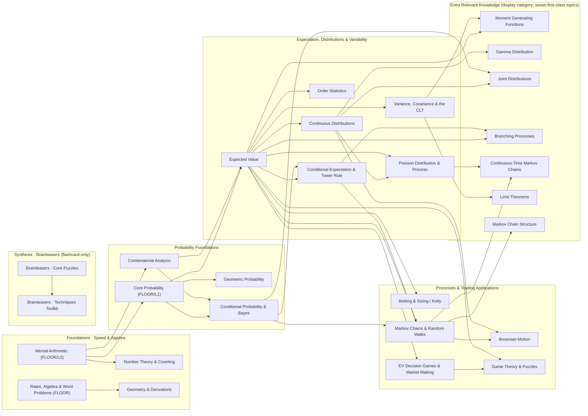

# Knowledge Graph — Case B ("Quant Interview / OA Prep" mode)

**Purpose.** A human-inspectable map of every concept in the **Case B** curriculum
(the app's current default), with its category, mastery `topicKey`, scored levels,
prerequisite edges, and a structural sanity-check of the prerequisite ordering for
interview / online-assessment (OA) prep.

**What "Case B" is (per `datasets/CASE_MODE_BUILD_PLAN.md` §0, §5).** Case B ≈ **today's
app**. All quant-focused tracks (Kelly/Betting, Game Theory, Interview Games / market
making, Brainteasers, Mental-Math speed, Fermi) are **first-class**. The UT M362K/M362M
"course-completeness" topics that no surveyed firm tests (MGF, Gamma, Joint densities,
Branching, CTMC, formal limit theorems, Markov chain structure) are now **seven
first-class topics** (each its own `topicKey` / mastery bucket / graph node); in Case B
they are *displayed* grouped under an **"Extra Relevant Knowledge"** category, but that
grouping is a display/projection concern, not a shared mastery bucket. Case B
`= goalMode "interview"` and is the safe default; Case A ("course mastery") is a
re-grouped *view* over the **same** `topicKey`-keyed mastery store, so this graph is also
the substrate Case A reprojects.

**Sources parsed.** `datasets/CASE_MODE_BUILD_PLAN.md`; `src/content/index.ts` +
`src/content/probabilityStats/index.ts` (aggregators); every `src/content/**/levels.ts`;
`src/content/remediation/prereqDAG.ts` (remediation DAG); `src/lib/roadmap/skillGraph.ts`
(ordered skill graph); `src/content/fermi/items.ts`.

**Two graphs, one topic set.** The app carries two prerequisite structures over the same
mastery buckets:
- **Skill graph** (`skillGraph.ts`) — the *full* ordered pathway. **28 nodes** = all 26
  scored topics **+** 2 flashcard-only Brainteasers topics.
- **Remediation DAG** (`prereqDAG.ts`) — the *acyclic subset restricted to remediable
  (scored) nodes* used for auto-launch backtracking. **26 nodes**, covering every scored
  topic (the 19 originals + Conditional Expectation + the seven first-class
  course-completeness topics that replaced the single "Extra Relevant Knowledge" node).

A mastery bucket ("topic") is `topicKey = ${trackId}::${section ?? "_core"}`. A *level* is
one playable unit inside a topic; a topic is **scored** if it has at least one non-flashcard
(`numeric`/`quiz`) level, and **flashcard-only** if every level is `mode: "flashcard"`
(these are self-assessed and excluded from remediation by design).

---

## 1. Concepts grouped by category / track

Legend for **Mode**: `num` = numeric free-response · `quiz` = MCQ · `fc` = flashcard
(self-assessed, not scored). **Scored?** = topic has ≥1 non-flashcard level. **DAG / SG** =
present in remediation DAG / skill graph.

### 1A. Foundations — Speed & Algebra (skill-graph tier `foundations`)

| Concept (section) | topicKey | Scored levels (id · difficulty · mode) | Flashcard-only levels | Scored? | DAG | SG |
|---|---|---|---|---|---|---|
| Mental Arithmetic | `mental-math::_core` | mm-1 easy num · mm-2 med num · mm-3 hard num · mm-4 hard num | — | ✅ | ✅ (**FLOOR/L0**) | ✅ |
| Rates, Algebra & Word Problems | `math-questions::Rates, Algebra & Word Problems` | mq-1 easy num · mq-3 med num | — | ✅ | ✅ (**FLOOR**) | ✅ |
| Number Theory & Counting | `math-questions::Number Theory & Counting` | mq-4 med num · mq-2 med num | — | ✅ | ✅ | ✅ |
| Geometry & Derivations | `math-questions::Geometry & Derivations` | mq-5 hard num | mq-6 hard fc | ✅ | ✅ | ✅ |

### 1B. Probability spine — Foundations (skill-graph tier `probability`)

| Concept (section) | topicKey | Scored levels | Flashcard-only | Scored? | DAG | SG |
|---|---|---|---|---|---|---|
| Core Probability (meaning / sample space) | `probability::Core Probability` | pr-1 easy · pr-2 med · pr-3 med · pr-4 hard · pr-5 expert (all num) | — | ✅ | ✅ (**FLOOR/L1**) | ✅ |
| Combinatorial Analysis | `probability::Combinatorial Analysis` | ca-1..ca-3 easy · ca-comp/ca-bino easy · ca-symm easy quiz · ca-4/5/6/7 med · ca-tourn/ca-count med · ca-8 hard (rest num) | ca-9 hard fc | ✅ | ✅ | ✅ |
| Conditional Probability & Bayes | `probability::Conditional Probability` | cp-1 easy · cp-2/3/4 med · cp-5 med quiz (rest num) | cp-6 hard fc | ✅ | ✅ | ✅ |

### 1C. Expectation, Distributions & Variability (skill-graph tier `expectation`)

| Concept (section) | topicKey | Scored levels | Flashcard-only | Scored? | DAG | SG |
|---|---|---|---|---|---|---|
| Expected Value | `probability::Expected Value` | ev-1/2 easy · ev-3/4/5 med · ev-6 hard · ev-7 hard quiz (rest num) | ev-8 hard fc | ✅ | ✅ | ✅ |
| **Conditional Expectation & Tower Rule** | `probability::Conditional Expectation` | ce-1 med num · ce-2 hard num | — | ✅ | ✅ | ✅ |
| Poisson Distribution & Process | `probability::Poisson Distribution & Process` | po-1 med · po-2/3 hard (num) | — | ✅ | ✅ | ✅ |
| Geometric Probability | `probability::Geometric Probability` | geo-1 easy · geo-2 med (num) | — | ✅ | ✅ | ✅ |
| Order Statistics | `probability::Order Statistics` | os-1 med num | — | ✅ | ✅ | ✅ |
| Continuous Distributions | `probability::Continuous Distributions` | cd-1/2 med · cd-3 hard (num) | — | ✅ | ✅ | ✅ |
| Variance, Covariance & the CLT | `probability::Variance, Covariance & the CLT` | vc-1 med · vc-2 hard (num) | vc-3 hard fc | ✅ | ✅ | ✅ |

### 1D. Stochastic Processes & Trading Applications (skill-graph tier `processes`)

| Concept (section) | topicKey | Scored levels | Flashcard-only | Scored? | DAG | SG |
|---|---|---|---|---|---|---|
| Betting & Sizing (Kelly) | `probability::Betting & Sizing` | bs-1 easy · bs-2 med · bs-3 hard · bs-4 expert (num) | — | ✅ | ✅ | ✅ |
| Markov Chains & Random Walks | `probability::Markov Chains` | mc-1/2 easy · mc-3/4 med · mc-walk med · mc-5 hard · mc-stationary hard (num) | mc-6 hard fc | ✅ | ✅ | ✅ |
| Brownian Motion | `probability::Brownian Motion` | bm-1 expert num | — | ✅ | ✅ | ✅ |
| EV Decision Games & Market Making | `interview-games::_core` | ig-1 med num · ig-basket med num · ig-2 hard quiz · ig-3 hard num · ig-books hard num · ig-4 expert quiz · ig-trading-decisions expert quiz | ig-fermi med fc | ✅ | ✅ | ✅ |
| Game Theory & Puzzles | `probability::Game Theory & Puzzles` | gt-1 easy quiz · gp-1 easy num · gt-2/3 med quiz · gt-4/5 hard num · gp-2 hard num · gt-spread/gt-agents hard num | gt-6 hard fc · gp-3 hard fc | ✅ | ✅ | ✅ |

### 1E. Course-completeness topics (seven first-class topics; firm-untested M362 completeness)

These were formerly one collapsed "Extra Relevant Knowledge" bucket. They are now **seven
independent topics**, each with its own `section` / `topicKey` / skill-graph node / DAG
node, its own prereqs, and its own scored `levelRef`. In Case B they are *displayed*
grouped under an "Extra Relevant Knowledge" category (a projection over these seven keys).

| Topic (section) | topicKey | Scored levels (id · difficulty · mode) | Prereqs | levelRef |
|---|---|---|---|---|
| Moment Generating Functions | `probability::Moment Generating Functions` | ek-mgf med quiz | Expected Value, Variance/CLT | ek-mgf |
| Gamma Distribution | `probability::Gamma Distribution` | ek-gamma med num | Continuous Distributions | ek-gamma |
| Joint Distributions | `probability::Joint Distributions` | ek-joint hard num · ek-joint-2 med num · ek-joint-3 hard num | Continuous Distributions, Conditional Probability | ek-joint |
| Branching Processes | `probability::Branching Processes` | ek-branching hard num | Expected Value, Conditional Expectation | ek-branching |
| Continuous-Time Markov Chains | `probability::Continuous-Time Markov Chains` | ek-ctmc hard num | Markov Chains, Poisson | ek-ctmc |
| Limit Theorems | `probability::Limit Theorems` | ek-limit hard quiz | Variance/CLT | ek-limit |
| Markov Chain Structure | `probability::Markov Chain Structure` | ek-markov-pn hard num · ek-markov-class hard quiz | Markov Chains | ek-markov-pn |

**Each is Scored ✅ · DAG ✅ · SG ✅** with its own node and prereqs (no longer one shared node).

> The **Joint Distributions** content (ek-joint, ek-joint-2, ek-joint-3) is its own topic.
> Its companion **double-integral simulation** (Simulations tab; planned `jointDensity.ts`
> per build-plan §8 WS-SIM) is a **Case A** feature — in Case B it is *shown but not
> emphasized* (hidden/optional, Decision D7).

### 1F. Synthesis — Brainteasers (flashcard-only; skill-graph tier `synthesis`)

| Concept (section) | topicKey | Levels | Scored? | DAG | SG |
|---|---|---|---|---|---|
| Brainteasers · Core Puzzles | `brainteasers::Core Puzzles` | 3 levels, **all fc** (logic, weighings, lateral) | ❌ fc-only | ❌ (by design) | ✅ |
| Brainteasers · Techniques Toolkit | `brainteasers::Techniques Toolkit` | 3 levels, **all fc** (invariants, parity, induction) | ❌ fc-only | ❌ (by design) | ✅ |

### 1G. Case-B features that are NOT mastery topics

- **Fermi Drill** (`src/content/fermi/items.ts`) — a numerically-graded estimation drill
  surfaced in Case B; a standalone feature, not a `topicKey` mastery bucket (distinct from
  the `ig-fermi` flashcard level inside Interview Games).
- **Speed Arena / timing** — a timed *mode* over Mental Arithmetic + the interview spine, not
  a separate topic.
- **Calibration Gym** (`calibration-gym`) — `comingSoon: true`, zero levels; excluded.

---

## 2. Mermaid prerequisite graph

Edges point **prerequisite → dependent** (arrow = "unlocks / is needed by"), matching the
skill graph (the superset of the remediation DAG). Clusters = categories. **`(FLOOR)`** = a
node remediation will not descend below. The seven former-ERK topics are now individual
nodes with their own real prereq edges.

---

## 3. Prerequisite table (concept → direct prereqs)

Source of truth = skill graph (superset). "†" marks an edge the remediation DAG also
carries (every scored edge below is now † — the DAG covers all 26 scored topics).

| Concept | Direct prerequisites |
|---|---|
| Mental Arithmetic | — (FLOOR) |
| Rates, Algebra & Word Problems | — (FLOOR) |
| Number Theory & Counting | Mental Arithmetic † |
| Geometry & Derivations | Rates/Algebra † |
| Core Probability | Mental Arithmetic † (FLOOR itself) |
| Combinatorial Analysis | Mental Arithmetic † |
| Geometric Probability | Core Probability † |
| Conditional Probability & Bayes | Core Probability †, Combinatorial Analysis † |
| Expected Value | Core Probability †, Combinatorial Analysis † |
| Conditional Expectation | Expected Value †, Conditional Probability † |
| Poisson Distribution & Process | Expected Value †, **Continuous Distributions †** |
| Order Statistics | Expected Value † |
| Continuous Distributions | Expected Value † |
| Variance, Covariance & the CLT | Expected Value † |
| Betting & Sizing (Kelly) | Expected Value † |
| EV Decision Games & Market Making | Expected Value † |
| Markov Chains & Random Walks | Conditional Probability †, Expected Value †, **Conditional Expectation †** |
| Brownian Motion | Markov Chains †, Continuous Distributions † |
| Game Theory & Puzzles | EV Decision Games & Market Making †, **Expected Value †** |
| Moment Generating Functions | Expected Value †, Variance/CLT † |
| Gamma Distribution | Continuous Distributions † |
| Joint Distributions | Continuous Distributions †, Conditional Probability † |
| Limit Theorems | Variance/CLT † |
| Branching Processes | Expected Value †, Conditional Expectation † |
| Continuous-Time Markov Chains | Markov Chains †, Poisson † |
| Markov Chain Structure | Markov Chains † |
| Brainteasers · Core Puzzles | — |
| Brainteasers · Techniques Toolkit | Brainteasers · Core Puzzles |

---

## 4. Structure analysis

### 4.1 Does the ordering make sense for interview / OA prep?
**Broadly, yes.** The spine mirrors the trader-interview canon and reads correctly:
timed **Mental Arithmetic** floors the whole graph (the first screen firms gate on:
Optiver 80-in-8, Jane Street, Zetamac), then **Core Probability → Counting →
{Conditional, Expected Value}**, and the desk applications (**Kelly, Interview Games /
market making, Markov/ruin, Game Theory**) all sit *downstream of Expected Value*, which is
exactly where OA/interview value concentrates (EV weight 3, Interview Games weight 3). The
firm-untested completeness topics are now seven low-weight (weight 1) leaves placed at the
end of the pathway (and displayed grouped under an "Extra Relevant Knowledge" category), so
they still don't clutter the interview path while remaining individually masterable.

### 4.2 Cycles
**None.** Both structures are acyclic (the DAG has an explicit `is acyclic` DFS test in
`prereqDAG.test.ts`; every skill-graph edge points strictly to an earlier-tier node).

### 4.3 Orphan nodes
No true orphans (no node is both prereq-less **and** dependent-less). Two observations:
- **Dead-end enrichment branch:** `Number Theory & Counting` and `Geometry & Derivations`
  (the `math-questions` side-topics) hang off the foundations floor but **nothing downstream
  depends on them** — they gate no probability/trading topic. Fine for OA breadth, but worth
  confirming that "no topic requires them" is intentional (they're pure enrichment, not on
  any critical path).
- **Flashcard synthesis island:** the two Brainteasers nodes form a 2-node chain disconnected
  from the probability spine (no prereqs into or out of it). Intentional — brainteasers are
  cross-cutting synthesis, not gated content.

### 4.4 Scored topics missing from the DAG / skill graph — RESOLVED
- **Conditional Expectation is now in the DAG.** ✅ `probability::Conditional Expectation`
  (ce-1/ce-2) has a node with prereqs `[Expected Value, Conditional Probability]` and
  `levelRef` ce-1. Auto-launch remediation now engages for it, and Markov Chains / Branching
  backtrack into it.
- **The seven former-ERK topics are now in the DAG too.** ✅ Each has its own node,
  prereqs, and scored `levelRef` (§3), so remediation routes to the correct sub-topic.
- **Coverage:** the DAG now enumerates **26** scored topics; the skill graph has **28**
  nodes (26 scored + 2 flashcard Brainteasers). No scored topic is missing from either.

### 4.5 Prereq edges — status after the split + corrections
- **The lossy "Extra Relevant Knowledge" super-node is gone.** ✅ The seven sub-topics are
  now separate nodes, each with its OWN prereqs and its OWN scored `levelRef`, so a learner
  who bombs (say) CTMC remediates against CTMC — not the MGF quiz. Specifically: Joint
  Distributions → **Continuous Distributions** (+ Conditional); CTMC → **Markov + Poisson**;
  Branching → **Expected Value + Conditional Expectation**; MGF → Expected Value +
  Variance/CLT; Gamma → Continuous; Limit Theorems → Variance/CLT; Markov Chain Structure →
  Markov.
- **Conditional Expectation is now well-connected downstream.** ✅ It is a prereq of
  **Branching Processes** (random-sums / first-step conditioning) and of **Markov Chains**
  (tower-rule first-step analysis).
- **Game Theory & Puzzles now has a direct `Expected Value` edge.** ✅ Added alongside the
  Interview-Games edge (its Kelly/EV-heavy puzzles rest on EV).
- **Poisson now depends on Continuous Distributions.** ✅ Added — the process-depth levels
  (po-2/po-3: exponential interarrivals) lean on the exponential density.
- **Betting/Interview Games skip Conditional Probability.** Both prereq only Expected Value.
  Acceptable (they are EV-first); adverse-selection reasoning in Market Making is
  conditional-probability-flavored — a soft edge, not a defect. *(Unchanged.)*

### 4.6 Foundations at the floor + fallback
**Correct.** Three floors are marked `floor: true` and remediation stops at them:
**Mental Arithmetic (L0)**, **Core Probability / meaning-of-probability (L1)**, and
**Rates/Algebra**. Mental Arithmetic has no prereqs (true L0 leaf); Rates/Algebra is a
prereq-less scored root; L1 depends only on L0 but is itself a teach-here floor (ZPD). Every
DAG node's `levelRef` is a real scored intro level (enforced by test), so fallback always has
an item to draw from. This is coherent: a learner who bombs, say, Bayes descends to Core
Probability / Counting / arithmetic and is taught there rather than dropped into a void.

### 4.7 Intentionally flashcard-only (excluded from remediation) — coherent?
**Yes, coherent.** The two Brainteasers topics are 100% flashcard (self-assessed, no scored
attempt), so `buildProbeItem` returns null and they are deliberately absent from the DAG.
Additionally, several **scored** topics carry one trailing flashcard "Desk" level (ev-8,
ca-9, mc-6, gt-6/gp-3, vc-3, cp-6, mq-6, ig-fermi) — those topics remain scored via their
other levels, so their DAG membership is unaffected. The only nuance: **Geometry &
Derivations** is scored by a *single* numeric level (mq-5) plus a flashcard (mq-6); it is
correctly in the DAG, but its scored surface is thin.

---

## 5. Recommendations

**Recommendations 1–3 are now DONE** (this refactor).

1. ✅ **`Conditional Expectation` added to `PREREQ_DAG`** (prereqs `[EXPECTED_VALUE,
   CONDITIONAL]`, `levelRef` = `ce-1`); the stale "all 19/20" docstring is updated to 26.
   The remediation gap is closed.
2. ✅ **The "Extra Relevant Knowledge" super-node was SPLIT into seven first-class topics**,
   each with correct prereqs and its own scored `levelRef` — so remediation routes to the
   right sub-topic instead of always landing on the MGF quiz. (Joint → Continuous +
   Conditional; Branching → EV + Conditional Expectation; CTMC → Markov + Poisson; etc.)
3. ✅ **Direct `Expected Value` prereq edge added to `Game Theory & Puzzles`** (previously
   only transitive via Interview Games). Also **Poisson → Continuous Distributions** added.
4. **Confirm the `math-questions` enrichment branch is intended as terminal.** Number Theory
   and Geometry gate nothing downstream; if that's by design, fine — otherwise consider
   linking Geometry to Geometric Probability. *(Unchanged; out of scope.)*
5. **Keep the Brainteasers flashcard exclusion as-is** — it is correct and well-documented.
6. **Watch thin scored surfaces** (Geometry & Derivations, Order Statistics, Brownian Motion,
   and several of the seven course-completeness topics have a single scored level). Not a
   graph defect, but a single bad level makes those topics fragile for mastery estimation
   and remediation probes.

> **Note for the mode-integration worker.** The seven course-completeness topics are now
> proper standalone data topics. **Case B** should *display* them grouped under an "Extra
> Relevant Knowledge" category; **Case A** distributes them into the two course tracks (MGF /
> Gamma / Joint / Limit → M362K; Branching / CTMC / Markov Chain Structure → M362M). That is
> a display/projection concern over the same seven topicKeys — not a data change.
